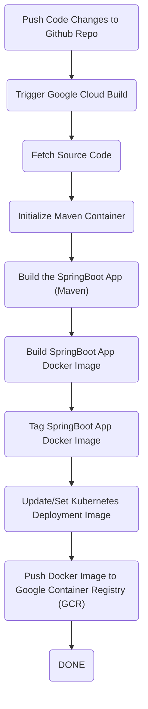

```mermaid

graph TD

A(Push Code Changes to Github Repo) --> B(Trigger Google Cloud Build)

B --> C("Fetch Source Code")

C --> D(Initialize Maven Container)

D --> E("Build the SpringBoot App (Maven)")

E --> F(Build SpringBoot App Docker Image)

F --> G(Tag SpringBoot App Docker Image)

G --> H(Update/Set Kubernetes Deployment Image)

H --> I("Push Docker Image to Google Container Registry (GCR)")

I --> J(DONE)

```